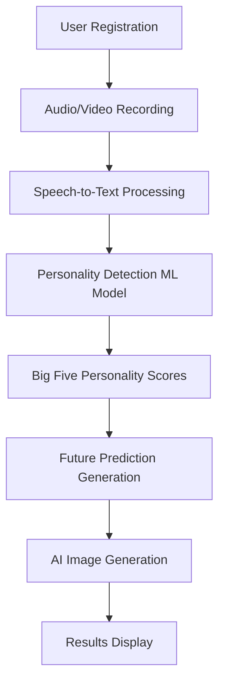

# PossiLives: AI-Powered Future Prediction Platform

## Project Overview

PossiLives is a sophisticated full-stack application that analyzes user personality through audio/video recordings and generates personalized future predictions accompanied by AI-generated visualizations. The system integrates advanced machine learning models, microservices architecture, and modern web technologies to provide users with insights into their potential life paths based on personality analysis and habit tracking.

## System Architecture

The project follows a **microservices architecture** with three main components:

```
┌─────────────────┐    ┌─────────────────┐    ┌─────────────────┐
│                 │    │                 │    │                 │
│   Frontend      │    │    Backend      │    │   AI Service    │
│   (React)       │◄──►│   (Spring)      │◄──►│   (Python)      │
│   Port: 3000    │    │   Port: 8081    │    │   Port: 5000    │
│                 │    │                 │    │                 │
└─────────────────┘    └─────────────────┘    └─────────────────┘
         │                       │                       │
         │                       │                       │
         └───────────────────────┼───────────────────────┘
                                 │
                    ┌─────────────────┐
                    │                 │
                    │   Keycloak      │
                    │   (Auth)        │
                    │   Port: 8080    │
                    │                 │
                    └─────────────────┘
```

## Core System Flow

### 1. User Journey & Personality Analysis Pipeline



### 2. Authentication & Security Layer

The system implements **OAuth 2.0 + OIDC** through Keycloak integration:

```java
@EnableAspectJAutoProxy
@SpringBootApplication
@EnableScheduling
public class MainApplication {
    @PostConstruct
    public void init() {
        TimeZone.setDefault(TimeZone.getTimeZone("Asia/Kuala_Lumpur"));
    }
}
```

**JWT Token Flow Implementation:**
```java
// JWT Authentication Converter
@Component
public class JwtAuthConverter implements Converter<Jwt, AbstractAuthenticationToken> {
    // Converts JWT to Spring Security Authentication Token
    // Extracts user roles and permissions from Keycloak realm
}
```

## Most Ingenious Implementations

### 1. **Multi-Modal AI Processing Pipeline** 🧠

The system's crown jewel is its sophisticated AI processing pipeline that combines multiple AI models:

#### A. Personality Detection Through Speech Analysis
```python
def personality_detection(text, threshold=0.05, endpoint=1.0):
    inputs = tokenizer(text, truncation=True, padding=True, return_tensors="pt")
    outputs = model(**inputs)
    predictions = outputs.logits.squeeze().detach().numpy()
    
    # Apply sigmoid to squash between 0 and 1
    probabilities = torch.sigmoid(torch.tensor(predictions))
    probabilities[probabilities < threshold] = 0.05
    probabilities[probabilities > endpoint] = 1.0
    
    label_names = ['Agreeableness', 'Conscientiousness', 'Extraversion', 
                   'Neuroticism', 'Openness']
    result = {label_names[i]: f"{probabilities[i] * 100:.0f}%" 
              for i in range(len(label_names))}
    return result
```

**Innovation:** Uses a fine-tuned transformer model that analyzes speech patterns and linguistic markers to determine Big Five personality traits with probabilistic confidence scoring.

#### B. Contextual Image Generation from Personality Insights
```python
def create_image_prompt_from_response(response_text):
    """
    Extract key themes from the response text to create an image generation prompt.
    This function analyzes the future-related text and creates a visual prompt.
    """
    text_lower = response_text.lower()
    
    theme_mappings = {
        'career': 'professional office environment, success, achievement',
        'love': 'romantic sunset, couple holding hands, hearts',
        'growth': 'flourishing tree, upward arrow, transformation',
        'health': 'vibrant nature, exercise, wellness',
        'success': 'golden trophy, celebration, achievement',
        # ... more mappings
    }
    
    # Extract themes and create cohesive visual prompt
    found_themes = []
    visual_elements = []
    
    for theme, visual in theme_mappings.items():
        if theme in text_lower:
            found_themes.append(theme)
            visual_elements.append(visual)
    
    base_prompt = f"A beautiful, inspiring vision of the future featuring {', '.join(visual_elements[:3])}"
    full_prompt = f"{base_prompt}, soft lighting, warm colors, hopeful atmosphere, cinematic composition"
    
    return full_prompt
```

**Innovation:** Dynamic prompt engineering that semantically analyzes generated future predictions to create contextually relevant visual representations.

### 2. **Advanced Video Processing with FFmpeg Integration** 🎥

```tsx
const processVideo = async (videoBlob) => {
    setIsProcessing(true);
    setProgress(0);
    
    try {
        // Load FFmpeg
        if (!ffmpeg.loaded) {
            await ffmpeg.load();
        }
        
        // Convert video blob to format suitable for processing
        const inputFileName = "input.webm";
        const outputFileName = "output.mp4";
        
        await ffmpeg.writeFile(inputFileName, await fetchFile(videoBlob));
        
        // Convert to MP4 with audio extraction optimization
        await ffmpeg.exec([
            "-i", inputFileName,
            "-c:v", "libx264",
            "-c:a", "aac",
            "-movflags", "+faststart",
            outputFileName
        ]);
        
        const outputData = await ffmpeg.readFile(outputFileName);
        const processedBlob = new Blob([outputData], { type: "video/mp4" });
        
        return processedBlob;
    } catch (error) {
        console.error("Error processing video:", error);
        throw error;
    }
};
```

**Innovation:** Client-side video processing using WebAssembly FFmpeg, enabling real-time video format conversion and optimization without server load.

### 3. **Intelligent Habit Validation System** 🎯

```python
def validate_habit():
    """
    Validate a habit using Gemini AI to check if it's:
    1. Not a duplicate
    2. Not NSFW/inappropriate  
    3. A valid positive habit
    """
    system_instruction = """You are a habit validation expert. Your task is to validate habits for a personal development app.

    Validation criteria:
    1. The habit should be positive and focused on personal growth/health/productivity
    2. It should not be NSFW, inappropriate, harmful, or offensive
    3. It should not be a duplicate or very similar to existing habits
    4. It should be actionable and specific enough to be tracked

    Respond ONLY with a JSON object in this exact format:
    {
        "is_valid": true/false,
        "reason": "explanation if invalid, null if valid",
        "suggestion": "improvement suggestion if invalid, null if valid"
    }"""
    
    # AI-powered validation with fallback logic
    result = generator.generate_text_only(
        prompt=prompt,
        system_instruction=system_instruction,
        model="gemini-2.5-flash-preview-05-20"
    )
```

**Innovation:** AI-powered content moderation that understands context and provides constructive feedback for habit formation.

### 4. **Responsive Future Generation Engine** ⚡

```python
def response_generator(details, big_5_personality, social_circle, habits, note):
    completion = jamai.table.add_table_rows(
        "action",
        p.RowAddRequest(
            table_id="main-action-table2",
            data=[dict(
                details=details, 
                big_5_personality=big_5_personality, 
                social_circle=social_circle, 
                habits=habits, 
                note=note
            )],
            stream=True,
        ),
    )
    
    # Stream processing for real-time response generation
    output_chunks = []
    for chunk in completion:
        if chunk.output_column_name != "answer":
            continue
        output_chunks.append(chunk.text)
    
    return ''.join(output_chunks)
```

**Innovation:** Streaming AI response generation using JamAI's action tables, providing real-time future prediction synthesis.

### 5. **Credit-Based Generation System** 💳

```java
@Service
@RequiredArgsConstructor
public class GenerationsService {
    
    @Auditable
    public Boolean createGeneration(String userId) {
        Users user = userRepository.findByKeycloakId(userId)
            .orElseThrow(() -> new RuntimeException("User not found"));
        Boolean balance = 0 < user.getGen_credits();

        if (balance) {
            user.setGen_credits(user.getGen_credits() - 1);
            userRepository.save(user);
        }
        return balance;
    }

    public Object getUserCredits(String userId) {
        Users user = userRepository.findByKeycloakId(userId)
            .orElseThrow(() -> new RuntimeException("User not found"));

        return Map.of(
            "credits_left", user.getGen_credits(),
            "max_credits", user.getMax_credits()
        );
    }
}
```

**Innovation:** Blockchain-inspired credit system with audit trails for tracking AI generation usage and implementing fair usage policies.

## System Complexity Analysis

### **High-Complexity Modules**

#### 1. **AI Processing Pipeline** (Complexity: ⭐⭐⭐⭐⭐)
- **Components:** Speech Recognition → NLP Processing → Personality Analysis → Future Generation → Image Generation
- **Challenges:** 
  - Multi-modal data processing (audio, video, text)
  - Real-time streaming of AI responses
  - Context-aware prompt engineering
  - Model orchestration across different AI services

#### 2. **Authentication & Authorization** (Complexity: ⭐⭐⭐⭐)
- **Components:** Keycloak Integration → JWT Processing → Role-Based Access Control
- **Challenges:**
  - OAuth 2.0 + OIDC implementation
  - Token refresh mechanisms
  - Cross-service authentication
  - Custom theme integration with Keycloakify

#### 3. **Real-time Media Processing** (Complexity: ⭐⭐⭐⭐)
- **Components:** WebRTC → FFmpeg Processing → Audio Extraction → Upload Management
- **Challenges:**
  - Browser compatibility for media recording
  - Client-side video processing with WebAssembly
  - Streaming upload optimization
  - Error handling for media failures

### **Medium-Complexity Modules**

#### 4. **Microservices Communication** (Complexity: ⭐⭐⭐)
- **Components:** REST APIs → Inter-service Communication → Data Synchronization
- **Implementation:**
```typescript
// Frontend API Configuration
export const api = axios.create({
    baseURL: 'http://localhost:8081',
    headers: { "Content-Type": "application/json" }
});

api.interceptors.request.use(async (config) => {
    if(keycloakInst.authenticated) {
        try {
            await keycloakInst.updateToken(30);
            config.headers.Authorization = `Bearer ${keycloakInst.token}`;
        } catch (error) {
            alert("Session Expired. Please login again.");
            keycloakInst.logout();
        }
    }
    return config;
});
```

#### 5. **Data Persistence & Audit System** (Complexity: ⭐⭐⭐)
- **Components:** JPA Repositories → Audit Logging → Transaction Management
- **Features:**
  - Automatic audit trails for all critical operations
  - Complex entity relationships (Users → Generations → Images → Habits)
  - Custom query optimization for personality data retrieval

### **Technology Stack Complexity**

#### **Frontend Architecture** (React + TypeScript)
```tsx
// Advanced routing with authentication guards
const ProtectedRoute: React.FC = () => {
  const [profileComplete, setProfileComplete] = useState<boolean | null>(null);
  const { keycloak, initialized } = useKeycloak();
  
  useEffect(() => {
    const fetchUserData = async () => {
      const userData = await initUser();
      const profileStatus = await checkUserProfileStatus();
      
      const profileSetupPages = [
        '/createprofile', '/testbridge', '/big5test', 
        '/smartpersonality', '/big5result', '/newhabits'
      ];
      
      if (!profileStatus.profileComplete && !isOnProfileSetupPage) {
        const nextStep = getNextProfileStep(profileStatus);
        navigate(nextStep);
      }
    };
    
    fetchUserData();
  }, [initialized, location.pathname, navigate]);
};
```

#### **Backend Architecture** (Spring Boot + PostgreSQL)
- **Design Patterns:** Repository Pattern, Service Layer, DTO Pattern
- **Security:** Method-level security with @PreAuthorize annotations
- **Scalability:** Connection pooling, caching strategies, async processing

#### **AI Service Architecture** (Python Flask + Multiple AI APIs)
- **Model Integration:** Hugging Face Transformers, Google Gemini, JamAI
- **Processing Pipeline:** Async request handling, streaming responses
- **Resource Management:** Memory optimization for ML models, GPU utilization

## Performance Optimizations

### 1. **Client-Side Optimizations**
- **Code Splitting:** Dynamic imports for route-based code splitting
- **Caching:** Intelligent caching of personality results and generation history
- **Media Optimization:** Progressive video upload with compression

### 2. **Backend Optimizations**
- **Database Indexing:** Composite indexes on frequently queried fields
- **Connection Pooling:** HikariCP for optimal database connections
- **Caching Strategy:** Redis implementation for session management

### 3. **AI Service Optimizations**
- **Model Loading:** Lazy loading of ML models to reduce startup time
- **Batch Processing:** Grouping similar requests for efficient processing
- **Response Streaming:** Real-time streaming of AI-generated content

## Deployment & DevOps

### **Containerization Strategy**
```dockerfile
# Multi-stage Docker builds for each service
FROM node:18-alpine AS frontend-build
FROM openjdk:17-jdk-slim AS backend-build  
FROM python:3.11-slim AS ai-service-build
```

### **Orchestration**
```yaml
# Docker Compose for development environment
services:
  keycloak:
    image: quay.io/keycloak/keycloak:latest
    ports: ["8080:8080"]
  backend:
    build: 
      context: ./possilives_backend
      target: dev
    ports: ["8081:8081", "5005:5005"]
  # Additional services...
```

## Innovation Highlights

1. **🚀 Real-time Personality Analysis:** Direct speech-to-personality mapping using transformer models
2. **🎨 Context-Aware Image Generation:** Dynamic visual creation based on personality insights
3. **🔄 Streaming AI Responses:** Real-time future prediction generation with progressive disclosure
4. **🛡️ AI-Powered Content Moderation:** Intelligent habit validation with constructive feedback
5. **📱 Progressive Web App:** Offline-capable with advanced media processing capabilities

## Future Enhancements

- **Machine Learning:** Continuous learning from user feedback to improve prediction accuracy
- **Social Features:** Community-driven future sharing and collaborative goal setting
- **Mobile App:** Native iOS/Android applications with enhanced offline capabilities
- **Analytics Dashboard:** Advanced analytics for tracking user engagement and system performance

---

*PossiLives represents a convergence of cutting-edge AI technologies, modern web development practices, and user-centric design, creating a unique platform for personal growth and future visualization.*
